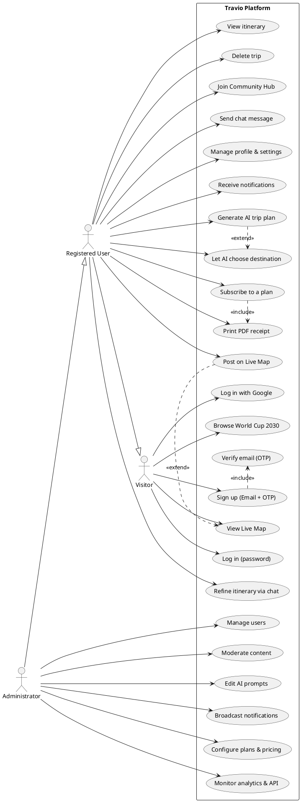
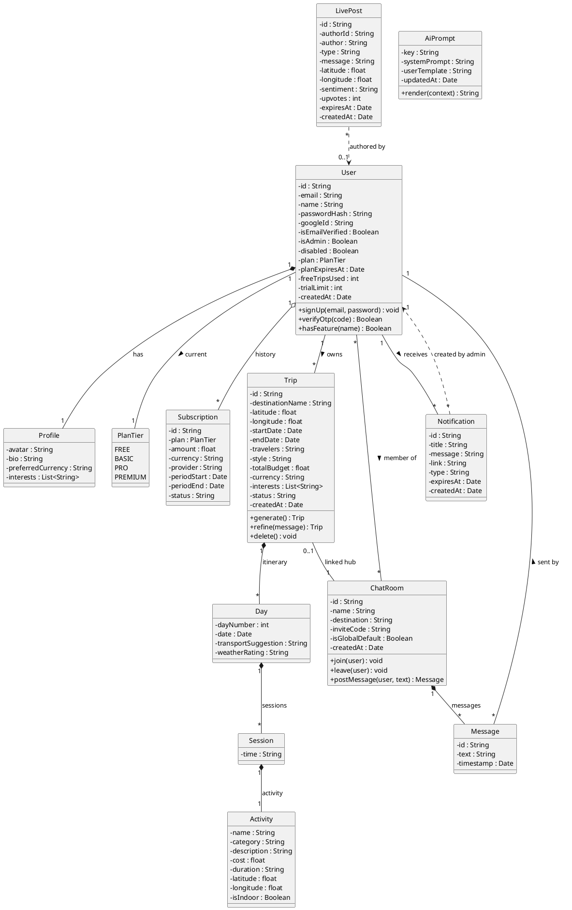
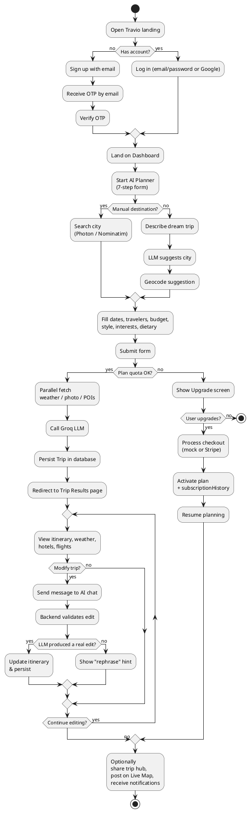

# Travio — UML Diagrams

> PlantUML source for the four UML diagrams used in the PFE report. Each block can be pasted directly into the [PlantUML web editor](https://www.plantuml.com/plantuml/uml/), the official VS Code / Windsurf PlantUML extension, or StarUML (via **File → Import → PlantUML**).
>
> All diagrams are kept deliberately classic (no skinparam eye-candy), medium-sized, and framed as a **domain model** — no database-implementation details, so the jury never has to debate "why MongoDB vs. SQL". The same class diagram maps 1:1 to any relational, document, or graph datastore.

---

## 1. Use Case Diagram

Covers the three primary actors of the platform and the full feature surface: authentication, AI planning, live social layer, billing, and administration.



---

## 2. Class Diagram (domain model)

Pure-UML class view of the business entities. All types are standard (`String`, `Date`, `float`, `List<T>`), and associations use multiplicities — nothing leaks MongoDB, Mongoose, or SQL. This diagram can be defended as "the logical data model" regardless of the persistence engine.



---

## 3. Sequence Diagram — "Generate AI trip plan"

The flagship workflow. Shows the full journey from a browser click to a persisted itinerary: authentication check, plan-quota gate, parallel external lookups (weather / photo / POI), LLM generation, persistence, and the HTTP response.

```plantuml
@startuml SequenceDiagram
actor User as U
participant "Planner UI\n(React)" as FE
participant "Express Router\n/api/trips" as API
participant "planGate\n(middleware)" as Gate
participant "plannerOrchestrator" as Orch
participant "weatherService" as Weather
participant "photoService" as Photo
participant "poiService" as POI
participant "aiService\n(Groq LLM)" as AI
database "Database" as DB

U  -> FE : Submits 7-step form
FE -> API : POST /api/trips/generate\n(JWT, form data)

API -> Gate : requireAuth + requireTripQuota
Gate -> DB  : load user, check plan & trialLimit
Gate --> API : OK

API -> Orch : orchestrate(tripData)

par Parallel fetch
  Orch -> Weather : forecast(destination)
  Weather --> Orch : daily summary
and
  Orch -> Photo   : getDestinationPhoto()
  Photo --> Orch  : image URL (or fallback)
and
  Orch -> POI     : overpass(destination)
  POI --> Orch    : nearby POIs
end

Orch -> AI : generateItinerary(ctx)
AI --> Orch : itinerary JSON

Orch -> DB : save Trip + create/link ChatRoom
DB --> Orch : saved Trip with _id

Orch --> API : Trip
API -> DB   : user.freeTripsUsed++
API --> FE  : 200 OK { trip }
FE --> U    : Navigates to /trip/:id
@enduml
```

---

## 4. Activity Diagram — End-to-end user journey

From landing to a saved trip, covering the quota/upgrade branch and the refine loop.



---

## How to render

**VS Code / Windsurf** — install the *PlantUML* extension (jebbs.plantuml), open this file, and preview with `Alt+D`.

**Online** — paste any block (between `@startuml` and `@enduml`) at `https://www.plantuml.com/plantuml/uml/`.

**StarUML** — `File → Import → PlantUML` and point at the extracted block, or use the PlantUML extension from the StarUML Extension Manager.

Each diagram exports cleanly to **PNG** or **SVG** at any resolution — recommended: SVG for the report, PNG 2× for the slide deck.
